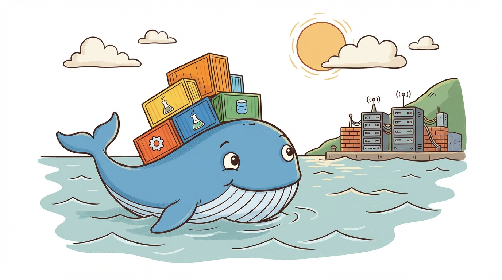
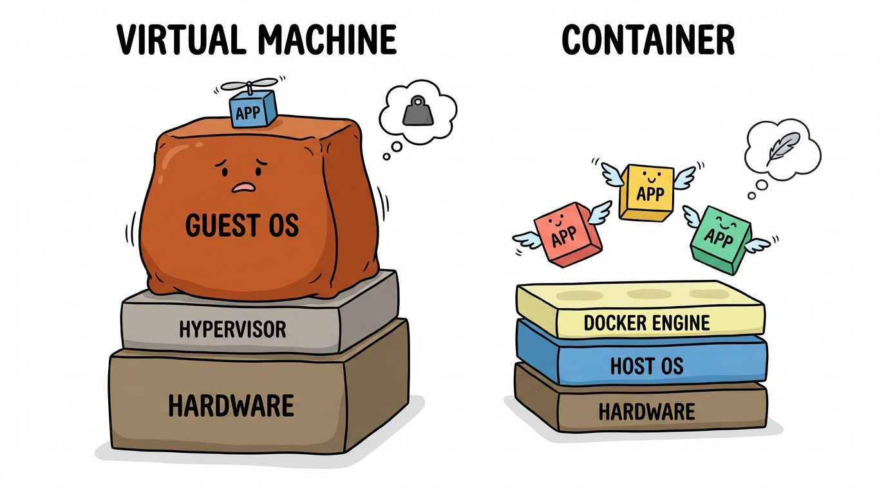
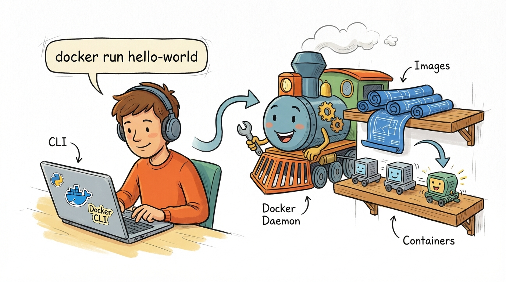
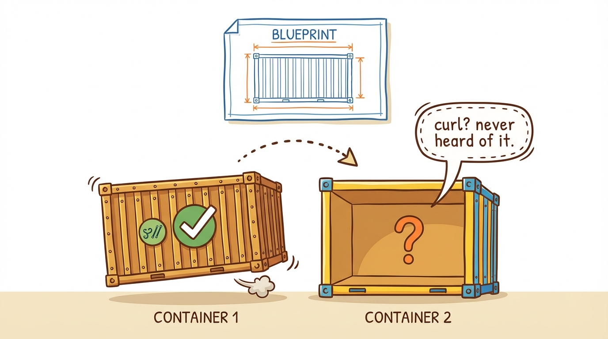
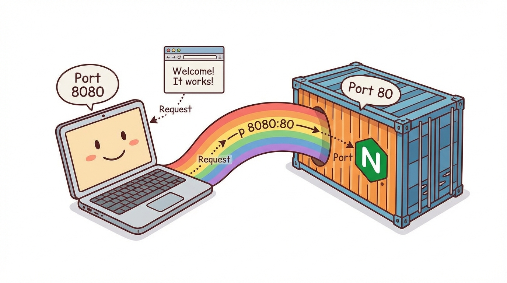

# Module 1: What Is Docker

> 🏷️ Start Here

> 🎯 **Teach:** What Docker is, how containers differ from virtual machines, and the basic Docker architecture.
> **See:** Docker installation, running hello-world, interactive containers, and a web server.
> **Feel:** Confident that Docker is approachable and immediately useful.

> 🔄 **Where this fits:** This is the foundation of everything. Before you can build images, compose services, or deploy to production, you need to understand what a container actually is and how Docker makes it work.

## What Is Docker?

> 🎯 **Teach:** What Docker is and why containers matter for modern software development.
> **See:** A concise definition of containers and the problem they solve.
> **Feel:** Curious about how Docker eliminates environment inconsistencies.



> 🎙️ Docker is a platform for running applications in containers, which are lightweight, isolated environments that package your code with everything it needs to run. Think of a container as a self-contained box with your application, its libraries, dependencies, and configuration all bundled together. No more "it works on my machine" problems.

Docker is a platform for running applications in **containers** — lightweight, isolated environments that package your code with everything it needs to run (libraries, dependencies, config).

## Containers vs Virtual Machines

> 🎯 **Teach:** The fundamental differences between containers and virtual machines.
> **See:** A side-by-side comparison of size, startup time, and isolation level.
> **Feel:** Clear on why containers are the lightweight, fast alternative to VMs.

> 🎙️ Containers and virtual machines both provide isolation, but they work very differently. A virtual machine virtualizes the hardware and runs a full guest operating system, which makes it heavy — gigabytes in size and minutes to start. A container virtualizes the operating system instead, sharing the host kernel while isolating the process. This makes containers tiny, fast, and efficient.

| Feature | Container | Virtual Machine |
|---------|-----------|-----------------|
| Size | Megabytes | Gigabytes |
| Startup | Seconds | Minutes |
| OS | Shares host kernel | Full guest OS |
| Isolation | Process-level | Hardware-level |
| Overhead | Minimal | Significant |

A VM virtualizes the **hardware** (runs a full OS). A container virtualizes the **operating system** (shares the host kernel, isolates the process).



> 💡 **Remember this one thing:** Containers share the host kernel and isolate at the process level, making them fast and lightweight. VMs run entire operating systems, making them heavier but more fully isolated.

## Docker Architecture

> 🎯 **Teach:** How the Docker client, daemon, images, and containers work together.
> **See:** A diagram of Docker's client-server architecture and key terminology.
> **Feel:** Grounded in the mental model you'll use for every Docker command.

> 🎙️ Docker has a simple client-server architecture. You type commands into the Docker CLI, which sends them to the Docker Daemon running in the background. The daemon manages images and containers. An image is like a class in object-oriented programming — it's a read-only template. A container is like an object — it's a running instance of that image.

```
Docker Client (CLI)
    ↓ commands
Docker Daemon (dockerd)
    ↓ manages
Images → Containers
```



- **Image** — A read-only template (like a class in OOP). Contains the OS, your app, and dependencies.
- **Container** — A running instance of an image (like an object). Isolated, ephemeral.
- **Docker Daemon** — Background service that manages containers.
- **Docker CLI** — Command-line tool you interact with.

## Install Docker

> 🎯 **Teach:** How to get Docker installed and running on any operating system.
> **See:** Installation commands and verification steps.
> **Feel:** Ready to start experimenting.

> 🎙️ Let's get Docker installed on your machine. The steps vary by operating system, but the goal is the same — get the Docker daemon running so you can start launching containers. If you're on Linux, you'll install Docker Engine directly. On Mac or Windows, you'll use Docker Desktop, which bundles everything together.

### Task A: Install Docker

Follow the instructions for your OS:

- **Linux:** Install Docker Engine
  ```bash
  # Ubuntu/Debian
  sudo apt update
  sudo apt install docker.io
  sudo systemctl start docker
  sudo systemctl enable docker
  sudo usermod -aG docker $USER
  ```
  Log out and back in for the group change to take effect.

- **macOS:** Install [Docker Desktop](https://www.docker.com/products/docker-desktop/)
- **Windows:** Install [Docker Desktop](https://www.docker.com/products/docker-desktop/) with WSL 2 backend

### Task B: Verify Installation

```bash
docker --version
docker info
```

`docker --version` shows the installed version. `docker info` shows details about the Docker daemon (containers, images, storage driver, etc.).

> 🎙️ Now let's make sure everything is working by running your very first container. The hello-world image is Docker's built-in smoke test — it pulls a tiny image, runs it, and prints a message confirming your installation is set up correctly.

### Task C: Test with Hello World

```bash
docker run hello-world
```

This command:
1. Looks for the `hello-world` image locally
2. Doesn't find it → downloads it from Docker Hub
3. Creates a container from the image
4. Runs the container (prints a message)
5. Container exits

Read the output — it explains exactly what happened.

## Explore Docker Commands

> 🎯 **Teach:** How to inspect images, list containers, and clean up after yourself.
> **See:** The output of docker images, docker ps, and docker rm in action.
> **Feel:** Confident navigating Docker's command-line tools.

> 🎙️ Now that you've run your first container, let's see what Docker left behind. The docker images command shows downloaded images, and docker ps shows running containers. Add the dash-a flag to also see stopped containers. Then you'll clean up by removing the container and image, leaving your system tidy.

### Task D: See What Happened

```bash
docker images
```

You should see the `hello-world` image listed. It was downloaded (pulled) from Docker Hub.

```bash
docker ps
```

No running containers — `hello-world` already exited. Show ALL containers (including stopped):

```bash
docker ps -a
```

You should see the stopped `hello-world` container with an `Exited` status.

> 🎙️ Good practice means cleaning up after yourself. Docker containers and images stick around on disk until you explicitly remove them. Let's remove the hello-world container and image so your system stays tidy. This cleanup habit will save you disk space as you work through more modules.

### Task E: Clean Up

```bash
docker rm $(docker ps -a -q --filter ancestor=hello-world)
docker rmi hello-world
docker images
docker ps -a
```

- `docker rm` removes stopped containers
- `docker rmi` removes images
- Now both lists should be clean

## Run a Real Container

> 🎯 **Teach:** How to run an interactive container and understand container isolation.
> **See:** An Ubuntu container running in seconds with a full shell, and proof that containers start fresh each time.
> **Feel:** Amazed at how fast and lightweight containers are.

> 🎙️ Let's get hands-on with a real container. You're going to launch an interactive Ubuntu environment, explore it, install software, then exit and start a new one to prove that containers are ephemeral — each one starts fresh from the image.

### Task F: Run an Interactive Ubuntu Container

```bash
docker run -it ubuntu bash
```

Flags:
- `-i` — Interactive (keep STDIN open)
- `-t` — Allocate a terminal (TTY)

You're now inside an Ubuntu container! Explore:

```bash
cat /etc/os-release
whoami
ls /
pwd
hostname
```

You're running a full Ubuntu environment, but it started in seconds and uses barely any resources. This is the power of containers.

Install something inside the container:

```bash
apt update
apt install -y curl
curl --version
```

Exit the container:

```bash
exit
```

### Task G: Prove Isolation

Run another Ubuntu container:

```bash
docker run -it ubuntu bash
```

Check for curl:

```bash
which curl
```

It's not there! Each container starts fresh from the image. The curl you installed in the previous container is gone because containers are **ephemeral** — changes don't persist unless you explicitly save them.

Exit:

```bash
exit
```



> 💡 **Remember this one thing:** Containers are ephemeral. Each container starts fresh from the image. Any changes you make inside a container are lost when it's removed, unless you use volumes (covered in Module 6).

## Running a Web Server

> 🎯 **Teach:** How to run a detached container with port mapping to serve a real web application.
> **See:** An Nginx web server running in Docker and accessible from your browser.
> **Feel:** Excited that you can spin up production-grade services in one command.

> 🎙️ Now let's do something practical — run a real web server. You'll launch Nginx in detached mode, map a port from your host into the container, and access it in your browser. This is the pattern you'll use constantly with Docker: run a service, map a port, and connect to it.

### Task H: Run Nginx

```bash
docker run -d -p 8080:80 --name my-nginx nginx
```

Flags:
- `-d` — Detached mode (runs in background)
- `-p 8080:80` — Map port 8080 on your machine to port 80 in the container
- `--name my-nginx` — Give the container a name



Check it's running:

```bash
docker ps
```

Open a browser and go to `http://localhost:8080` — you should see the Nginx welcome page.

Or test from the terminal:

```bash
curl http://localhost:8080
```

> 🎙️ When you're done with a container, you stop it first, then remove it. Stopping sends a graceful shutdown signal, and removing deletes the container from your system. You'll do this constantly as you work with Docker.

### Task I: Stop and Remove

```bash
docker stop my-nginx
docker rm my-nginx
```

## Submission

Save a file named `Day_01_Output.md` in this folder containing the terminal output from each task.

> 🎙️ That wraps up your first module. You've installed Docker, run your first container, explored an interactive Ubuntu environment, and launched a web server. These are the building blocks for everything that follows. Make sure you capture your terminal output before moving on.

### Grading Criteria

| Criteria | Points |
|----------|--------|
| Docker installed and version confirmed | 10 |
| `docker info` output captured | 10 |
| `hello-world` run and output understood | 10 |
| `docker images` and `docker ps -a` output shown | 10 |
| Interactive Ubuntu container explored | 15 |
| Isolation demonstrated (curl missing in second container) | 15 |
| Nginx container run with port mapping | 15 |
| Browser or curl confirmed Nginx working | 10 |
| Containers cleaned up | 5 |
| **Total** | **100** |
