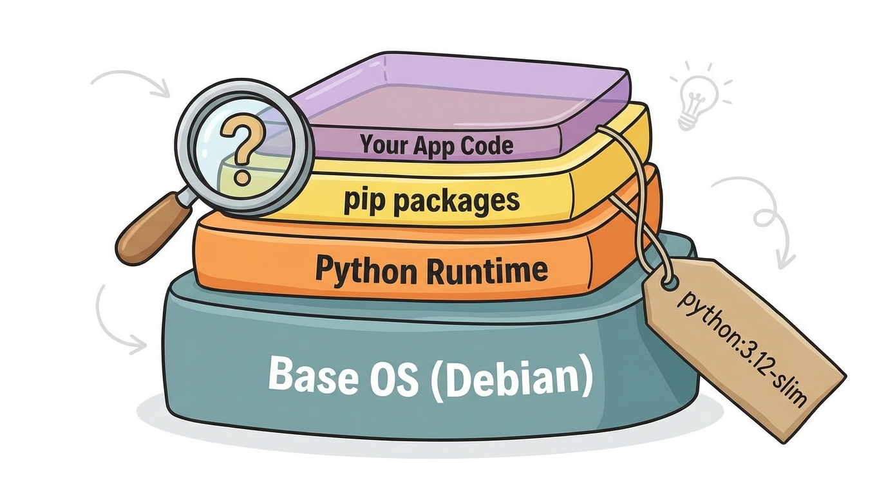
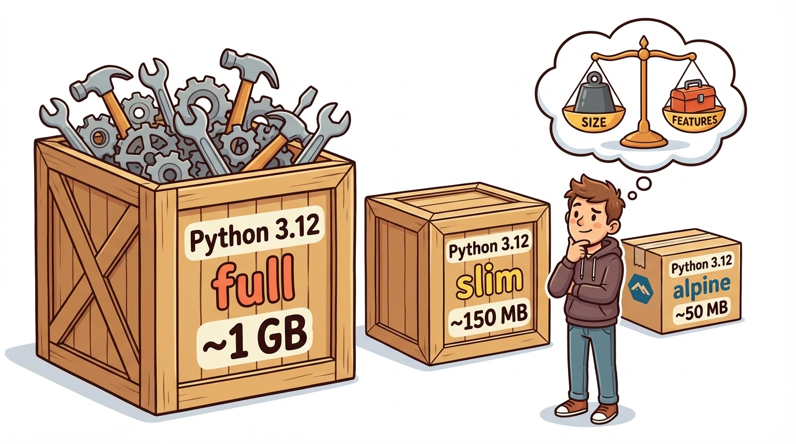
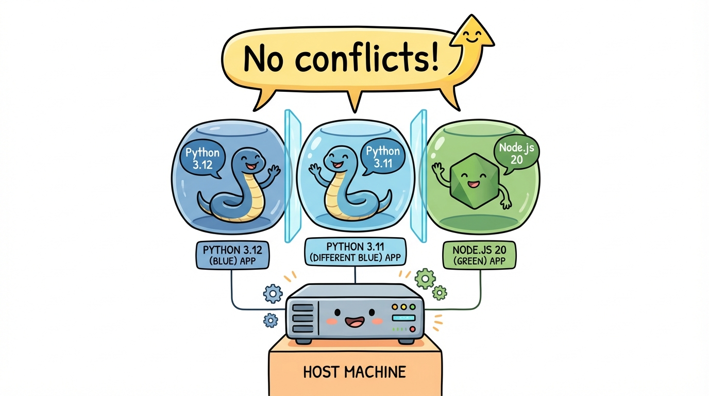
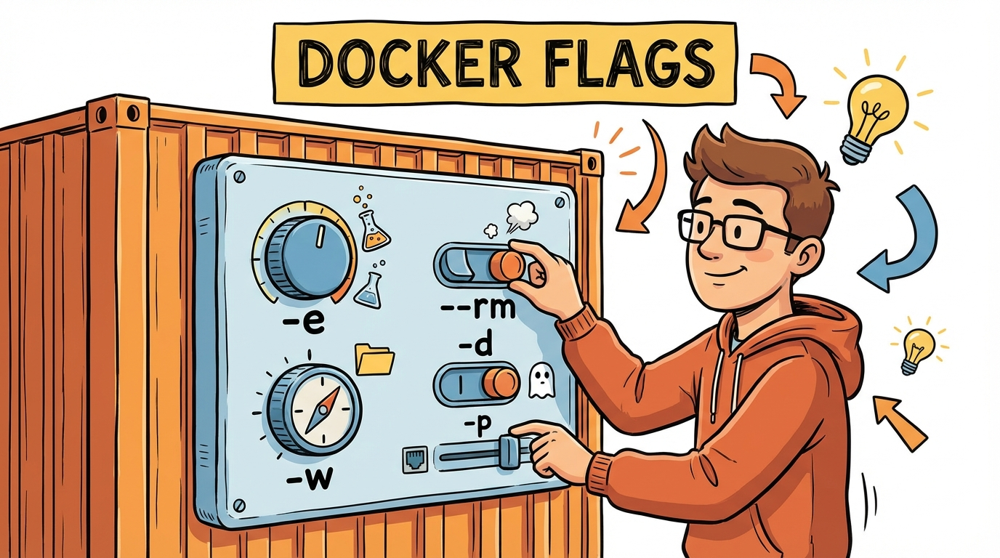

# Module 2: Images and Containers

> 🏷️ Start Here

> 🎯 **Teach:** How Docker images work, what tags and layers are, and how to run containers with various options.
> **See:** Pulling different image variants, comparing sizes, running Python and Node.js, passing environment variables.
> **Feel:** Comfortable working with images from Docker Hub and running containers with flags.

> 🔄 **Where this fits:** In Module 1 you ran pre-built containers. Now you'll learn how images are organized, tagged, and layered — the knowledge you need before building your own images in Modules 4 and 5.

## Docker Images

> 🎯 **Teach:** What Docker images are and how they are identified by registry, repository, and tag.
> **See:** Examples of common image naming conventions from Docker Hub.
> **Feel:** Comfortable reading and understanding any image reference you encounter.



> 🎙️ An image is a layered, read-only template identified by a registry, repository, and tag. For example, python colon 3.12 dash slim means the Python image, version 3.12, in the slim variant. Tags let you pick exactly the version and size you need. Understanding tags is critical because pulling the wrong variant can mean the difference between a 50 megabyte image and a 1 gigabyte image.

An image is a layered, read-only template. Images are identified by:

```
registry/repository:tag
```

Examples:
- `nginx:latest` — Latest Nginx from Docker Hub
- `python:3.12-slim` — Python 3.12 slim variant
- `ubuntu:22.04` — Specific Ubuntu version
- `node:20-alpine` — Node.js on lightweight Alpine Linux

## Tags and Variants

> 🎯 **Teach:** How tags and variants (slim, alpine, versioned) affect image size and contents.
> **See:** A comparison table of common tag conventions and what they mean.
> **Feel:** Informed about choosing the right image variant for each situation.

> 🎙️ Tags identify specific versions of an image. The latest tag is the default, but it doesn't always mean the newest version. Slim variants remove build tools and extra packages. Alpine variants use Alpine Linux as the base, making them the smallest option. Choosing the right variant is one of the simplest optimizations you can make.

| Tag | Meaning |
|-----|---------|
| `latest` | Default tag (not always the newest!) |
| `3.12` | Specific version |
| `3.12-slim` | Minimal variant (smaller) |
| `3.12-alpine` | Alpine Linux base (smallest) |
| `bookworm` | Debian Bookworm base |

> 🎙️ Under the hood, every Docker image is made up of layers stacked on top of each other. Each layer represents a change, like installing a package or copying a file. Docker caches and reuses these layers across images, which saves both download time and disk space.

### Image Layers

Images are built in **layers**. Each instruction in a Dockerfile creates a layer. Layers are cached and shared between images, saving disk space and download time.

> 💡 **Remember this one thing:** Always use specific image tags in production (like `python:3.12-slim`), never just `latest`. This ensures reproducible builds and prevents surprise updates.

## Pulling Images

> 🎯 **Teach:** How to pull image variants and compare their sizes.
> **See:** The dramatic size difference between full, slim, and Alpine images.
> **Feel:** Informed about which variant to choose for different use cases.

> 🎙️ Let's see the size differences for yourself. You're going to pull three variants of the Python image — the full version, the slim version, and the Alpine version. Then you'll compare their sizes and see why choosing the right variant matters.

### Task A: Pull Different Image Variants

```bash
docker pull python:3.12
docker pull python:3.12-slim
docker pull python:3.12-alpine
```

Compare their sizes:

```bash
docker images | grep python
```

You'll see a dramatic size difference:
- `python:3.12` — ~1 GB (full Debian with build tools)
- `python:3.12-slim` — ~150 MB (Debian without extras)
- `python:3.12-alpine` — ~50 MB (Alpine Linux, minimal)



> 🎙️ The docker inspect command reveals everything Docker knows about an image — its layers, environment variables, entry point, and more. You can also use format strings to pull out specific fields, which is handy for scripting.

### Task B: Inspect an Image

```bash
docker inspect python:3.12-slim
```

This shows detailed metadata: layers, environment variables, entry point, and more.

Try a focused query:

```bash
docker inspect --format='{{.Config.Env}}' python:3.12-slim
docker inspect --format='{{.Size}}' python:3.12-slim
```

## Running Containers from Different Images

> 🎯 **Teach:** How to run different language runtimes and versions side by side using Docker.
> **See:** Python and Node.js containers running simultaneously with zero conflicts.
> **Feel:** Amazed at how easily Docker eliminates version management headaches.

> 🎙️ One of Docker's superpowers is the ability to run different languages and different versions side by side with zero conflicts. You can run Python 3.12 and Python 3.11 at the same time, on the same machine, with no installation and no version conflicts. Try doing that without containers!

### Task C: Run Python in a Container

```bash
docker run -it python:3.12-slim python3
```

You're in a Python REPL inside a container:

```python
>>> import sys
>>> print(sys.version)
>>> print("Hello from Docker!")
>>> exit()
```

Run a one-liner without entering interactive mode:

```bash
docker run python:3.12-slim python3 -c "print('Hello from Docker!')"
```

### Task D: Run Node.js

```bash
docker pull node:20-alpine
docker run node:20-alpine node -e "console.log('Hello from Node.js in Docker!')"
```

### Task E: Run Multiple Versions Side by Side

```bash
docker run python:3.12-slim python3 -c "import sys; print(f'Python {sys.version}')"
docker pull python:3.11-slim
docker run python:3.11-slim python3 -c "import sys; print(f'Python {sys.version}')"
```



Two different Python versions, no conflicts, no installing anything on your system.

## Container Naming and Listing

> 🎯 **Teach:** How to name containers and use docker ps, inspect, and stats to monitor them.
> **See:** Named containers being created, listed, inspected, and cleaned up.
> **Feel:** Organized and in control of your running containers.

> 🎙️ By default, Docker assigns random names to containers like "quirky underscore einstein." That's fine for quick tests, but in real work you'll want to name your containers so you can reference them easily in logs, exec, and stop commands.

### Task F: Named Containers

```bash
docker run -d --name web-server nginx
docker run -d --name api-server python:3.12-slim python3 -m http.server 8000
```

List running containers:

```bash
docker ps
```

Names make containers easy to reference:

```bash
docker logs web-server
docker logs api-server
```

> 🎙️ You can dig deeper into a running container using docker inspect and docker stats. Inspect shows you the container's internal IP address, mount points, and configuration. Stats gives you a live dashboard of CPU, memory, and network usage across all your running containers.

### Task G: Container Details

```bash
docker inspect web-server --format='{{.NetworkSettings.IPAddress}}'
docker stats --no-stream
```

`docker stats` shows real-time CPU, memory, and network usage for all running containers.

> 🎙️ Before moving on, let's clean up the containers you created. Stopping and removing containers after you're done with them is a habit you should build early. It keeps your system from filling up with stale containers.

### Task H: Clean Up

```bash
docker stop web-server api-server
docker rm web-server api-server
```

## Running Containers with Options

> 🎯 **Teach:** How to pass environment variables, auto-cleanup containers, and set working directories.
> **See:** The -e, --rm, and -w flags in action.
> **Feel:** In control of how containers behave at runtime.

> 🎙️ Docker gives you fine-grained control over container behavior at runtime. You can inject environment variables, set the working directory, and tell Docker to automatically clean up the container when it exits. These flags are things you'll use in almost every docker run command.



### Task I: Environment Variables

Pass environment variables into a container:

```bash
docker run -e MY_NAME="Campbell" -e MY_ROLE="Intern" python:3.12-slim \
    python3 -c "import os; print(f'{os.environ[\"MY_NAME\"]} is a {os.environ[\"MY_ROLE\"]}')"
```

### Task J: Automatic Cleanup with `--rm`

Normally stopped containers stick around. Use `--rm` to auto-delete on exit:

```bash
docker run --rm python:3.12-slim python3 -c "print('I will be cleaned up automatically')"
docker ps -a
```

The container won't appear in `docker ps -a` — it was removed on exit.

### Task K: Working Directory

```bash
docker run --rm -w /app python:3.12-slim pwd
```

The `-w` flag sets the working directory inside the container.

> 💡 **Remember this one thing:** Use `--rm` for throwaway containers (one-off commands, testing). It prevents the accumulation of stopped containers that clutter your system.

## Submission

Save a file named `Day_02_Output.md` in this folder containing the terminal output from each task.

> 🎙️ Great work on this module. You now know how to pull images, compare variants, run containers from different language runtimes, and control container behavior with flags. These skills form the foundation for building your own custom images in the next modules.

### Grading Criteria

| Criteria | Points |
|----------|--------|
| Three Python variants pulled and sizes compared | 15 |
| Image inspected with `docker inspect` | 10 |
| Python REPL run inside container | 10 |
| Node.js run from a container | 10 |
| Multiple Python versions run side by side | 10 |
| Named containers created and logged | 15 |
| `docker stats` output captured | 5 |
| Environment variables passed to container | 10 |
| `--rm` auto-cleanup demonstrated | 10 |
| All containers cleaned up | 5 |
| **Total** | **100** |
