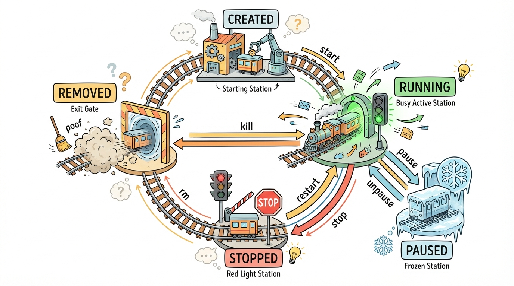
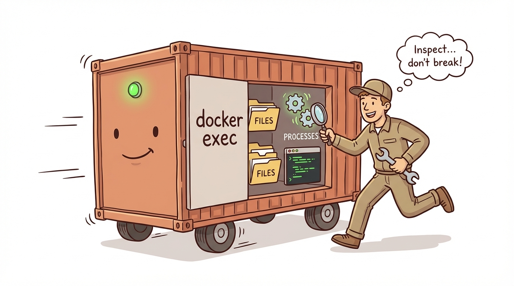
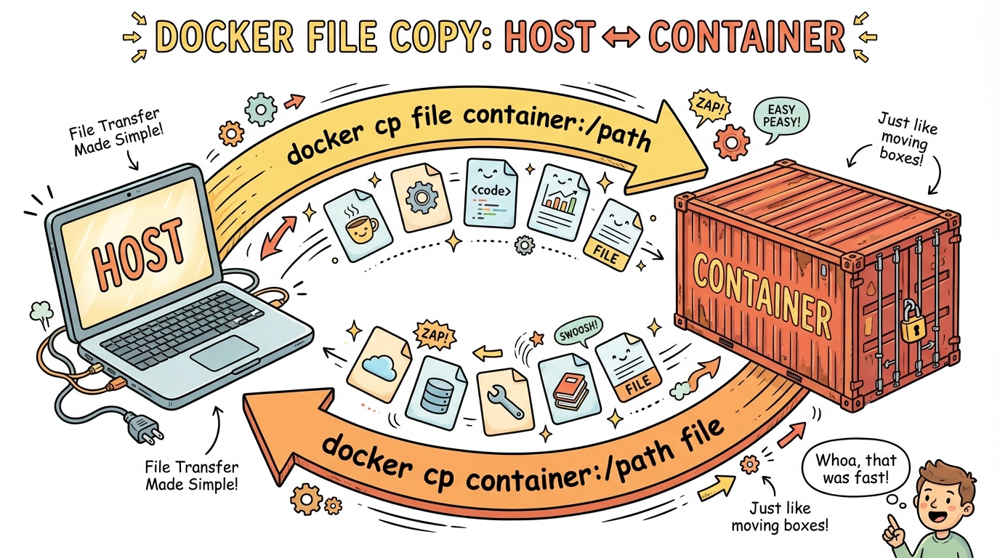
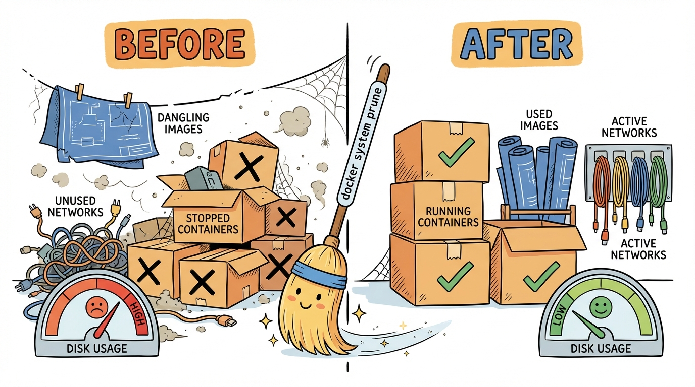

# Module 3: Container Management

> 🏷️ Start Here

> 🎯 **Teach:** The full container lifecycle and the commands to manage containers through each state.
> **See:** Starting, stopping, pausing, restarting, logging, exec-ing into, and copying files to/from containers.
> **Feel:** Fully in command of your containers — you know how to manage, debug, and maintain them.

> 🔄 **Where this fits:** Modules 1 and 2 covered running containers. Now you'll learn to manage them throughout their lifecycle — the operational skills you need before building custom images in Modules 4 and 5.

## Container Lifecycle

> 🎯 **Teach:** The states a container passes through and the commands that trigger each transition.
> **See:** A lifecycle diagram and a reference table of management commands.
> **Feel:** Confident that you understand every stage of a container's life.

> 🎙️ A container moves through a series of states: created, running, paused, stopped, and removed. Understanding this lifecycle is essential because you'll use different commands at each stage. A stopped container can be restarted. A paused container freezes all processes but keeps them in memory. And a removed container is gone for good.

```
Created → Running → Paused → Running → Stopped → Removed
           ↑                                        |
           └────────── Restarted ───────────────────┘
```



### Management Commands

| Command | Purpose |
|---------|---------|
| `docker start <name>` | Start a stopped container |
| `docker stop <name>` | Gracefully stop (SIGTERM, then SIGKILL after 10s) |
| `docker kill <name>` | Force stop immediately (SIGKILL) |
| `docker restart <name>` | Stop and start again |
| `docker pause <name>` | Freeze all processes |
| `docker unpause <name>` | Resume frozen processes |
| `docker rm <name>` | Remove a stopped container |
| `docker logs <name>` | View container output |
| `docker exec <name> <cmd>` | Run a command in a running container |
| `docker cp` | Copy files between container and host |

> 💡 **Remember this one thing:** `docker stop` sends SIGTERM first (graceful shutdown), then SIGKILL after 10 seconds. `docker kill` sends SIGKILL immediately. Always prefer `stop` unless a container is unresponsive.

## Start, Stop, and Restart

> 🎯 **Teach:** How to control container state transitions.
> **See:** A container being stopped, started, paused, unpaused, and restarted.
> **Feel:** Comfortable managing container state like a pro.

> 🎙️ Let's start by creating a long-running container that stays up so you can practice managing it. You'll use Nginx again since it runs as a background service and won't exit immediately. This container will be your playground for the next several tasks.

### Task A: Create a Long-Running Container

```bash
docker run -d --name my-app nginx
docker ps
```

### Task B: Stop and Start

```bash
docker stop my-app
docker ps            # Not listed — it's stopped
docker ps -a         # Listed with status "Exited"
docker start my-app
docker ps            # Running again
```

> 🎙️ Pausing is different from stopping. When you pause a container, all its processes are frozen in place using Linux cgroups, but they stay in memory. When you unpause, everything resumes exactly where it left off. This is useful when you need to temporarily free up CPU without losing the container's current state.

### Task C: Pause and Unpause

```bash
docker pause my-app
docker ps            # Status shows "Paused"
docker unpause my-app
docker ps            # Back to "Up"
```

### Task D: Restart

```bash
docker restart my-app
docker ps
```

Notice the "Up" time resets — the container was fully stopped and restarted.

## Logs

> 🎯 **Teach:** How to view, filter, and follow container logs for debugging.
> **See:** Log output filtered by tail count, time range, and live streaming.
> **Feel:** Equipped with the primary tool for diagnosing container issues.

> 🎙️ Container logs are your primary debugging tool. Every container captures standard output and standard error, and you can view it anytime with docker logs. The tail flag shows the last N lines, the since flag shows recent logs, and the dash-f flag follows the log stream in real-time, just like tail dash-f on a regular log file.

### Task E: View Container Logs

```bash
docker logs my-app
```

Shows all output from the container since it started.

Useful flags:

```bash
docker logs --tail 5 my-app       # Last 5 lines
docker logs --since 1m my-app     # Last 1 minute
docker logs -f my-app             # Follow (live stream) — Ctrl+C to stop
```

> 🎙️ Logs are only useful if there's something in them. Let's generate some log entries by making requests to your Nginx container, and then try a busybox container that produces a steady stream of heartbeat messages. This will give you real data to practice filtering with tail, since, and follow.

### Task F: Generate Some Logs

Open another terminal and make some requests to generate log entries:

```bash
curl http://localhost:80 2>/dev/null || docker exec my-app curl -s http://localhost
```

Or use a container that produces lots of output:

```bash
docker run -d --name log-demo busybox sh -c 'while true; do echo "$(date): heartbeat"; sleep 2; done'
docker logs -f log-demo
```

Press `Ctrl+C` to stop following. Then:

```bash
docker logs --tail 3 log-demo
docker stop log-demo && docker rm log-demo
```

## Executing Commands in Running Containers

> 🎯 **Teach:** How to run commands and open interactive shells inside running containers.
> **See:** Using docker exec to inspect files, run diagnostics, and modify a live container.
> **Feel:** Empowered to debug any running container without stopping it.

> 🎙️ Docker exec is one of your most powerful tools. It lets you run any command inside a running container without stopping it. You can check configuration files, run diagnostics, or open a full interactive shell. Think of it as SSH-ing into your container, except it's built right into Docker.



### Task G: Run Commands with `docker exec`

```bash
docker exec my-app hostname
docker exec my-app cat /etc/nginx/nginx.conf
docker exec my-app ls /usr/share/nginx/html/
```

`exec` runs a command inside a **running** container without stopping it.

> 🎙️ Running individual commands with exec is great, but sometimes you need to poke around interactively. By adding the dash-i and dash-t flags, you can open a full bash shell inside the container and explore it just like you would any Linux system.

### Task H: Open an Interactive Shell

```bash
docker exec -it my-app bash
```

You're now inside the running Nginx container. Explore:

```bash
ls /usr/share/nginx/html/
cat /usr/share/nginx/html/index.html
echo "<h1>Modified from inside!</h1>" > /usr/share/nginx/html/index.html
exit
```

The Nginx container is still running — `exec` didn't affect it.

### Task I: Verify the Change

```bash
docker exec my-app cat /usr/share/nginx/html/index.html
```

The file was modified inside the running container. But remember — this change is ephemeral. If you remove and recreate the container, it's gone.

## Copying Files

> 🎯 **Teach:** How to copy files between your host and a running container in both directions.
> **See:** Extracting a config file from a container and pushing a custom file into one.
> **Feel:** Able to exchange files with containers without rebuilding images.

> 🎙️ Docker cp lets you copy files between your host machine and a container in both directions. This is useful for pulling configuration files out of a container to inspect them, or pushing custom files into a running container without rebuilding the image.



### Task J: Copy Files Between Host and Container

Copy a file FROM a container to your host:

```bash
docker cp my-app:/etc/nginx/nginx.conf ./nginx.conf
cat nginx.conf
```

Copy a file TO a container from your host:

```bash
echo "<h1>Hello from the host!</h1>" > custom-index.html
docker cp custom-index.html my-app:/usr/share/nginx/html/index.html
docker exec my-app cat /usr/share/nginx/html/index.html
```

> 💡 **Remember this one thing:** `docker exec` runs commands in running containers. `docker cp` copies files in either direction. These two commands are your primary tools for debugging and inspecting containers without rebuilding.

## Bulk Operations

> 🎯 **Teach:** How to manage multiple containers at once and reclaim disk space.
> **See:** Stopping containers in bulk, pruning stopped containers, and checking Docker disk usage.
> **Feel:** Ready to keep your system clean and resources under control.

> 🎙️ In the real world, you'll often have many containers running at once. Docker provides commands for managing them in bulk — stopping multiple containers at once, pruning all stopped containers, and checking how much disk space Docker is using. These housekeeping commands keep your system clean and your resources under control.

### Task K: Managing Multiple Containers

Start several containers:

```bash
docker run -d --name app1 nginx
docker run -d --name app2 nginx
docker run -d --name app3 nginx
docker ps
```

Stop all at once:

```bash
docker stop app1 app2 app3
```

Remove all stopped containers:

```bash
docker container prune
```

`prune` removes ALL stopped containers. Answer `y` to confirm.

> 🎙️ Docker system df is like the du command for Docker. It shows you exactly how much disk space your images, containers, and volumes are consuming. If things are getting out of hand, docker system prune is your nuclear option — it removes all stopped containers, unused networks, and dangling images in one shot.



### Task L: System Cleanup

```bash
docker system df
```

This shows disk usage by images, containers, and volumes. Clean everything unused:

```bash
docker system prune
```

Also clean up the remaining containers:

```bash
docker stop my-app && docker rm my-app
```

## Submission

Save a file named `Day_03_Output.md` in this folder containing the terminal output from each task.

> 🎙️ You've now mastered the full container lifecycle — starting, stopping, pausing, logging, exec-ing, and copying files. These operational skills are what separate someone who can run Docker from someone who can actually manage and debug containers in a real environment.

### Grading Criteria

| Criteria | Points |
|----------|--------|
| Container started, stopped, and restarted | 10 |
| Pause and unpause demonstrated | 10 |
| Logs viewed with --tail, --since, and -f | 15 |
| `docker exec` used to run commands | 15 |
| Interactive shell opened in running container | 10 |
| File modified inside container | 10 |
| Files copied with `docker cp` (both directions) | 15 |
| Multiple containers managed and pruned | 10 |
| `docker system df` output captured | 5 |
| **Total** | **100** |
