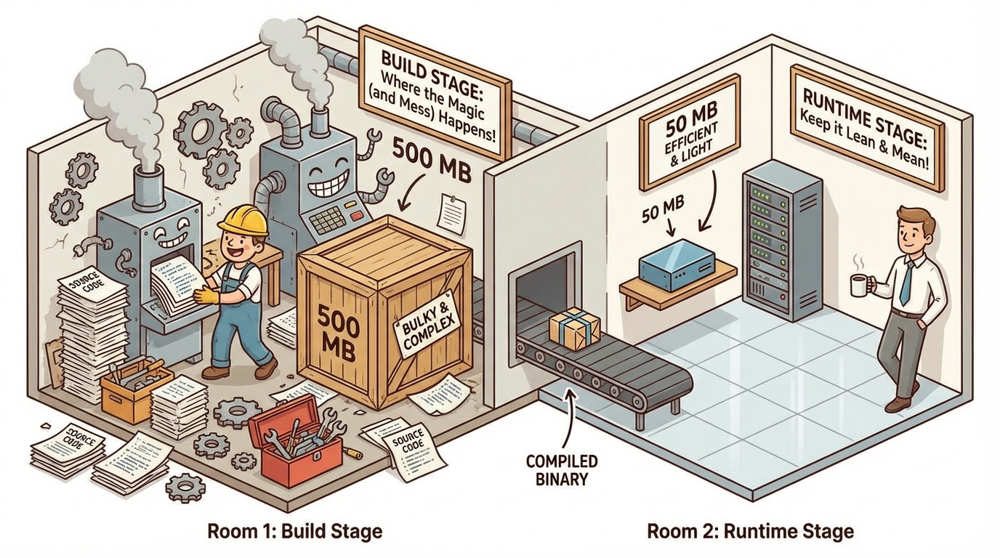
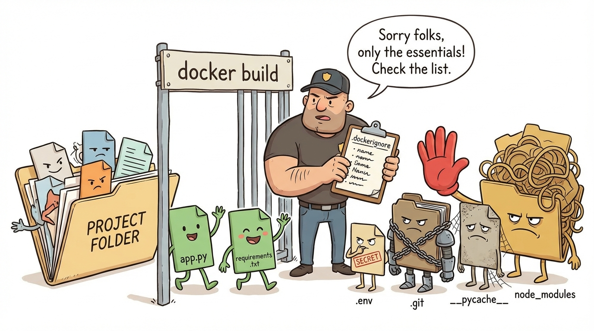
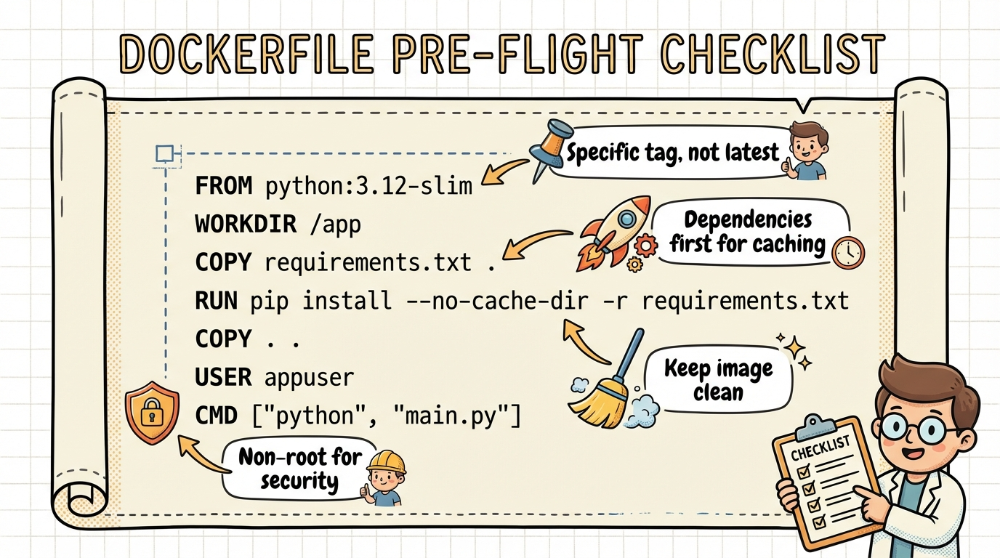

# Module 5: Dockerfiles Part 2

> 🏷️ Useful Soon

> 🎯 **Teach:** Advanced Dockerfile techniques: layer optimization, multi-stage builds, .dockerignore, and security best practices.
> **See:** Dramatic image size reductions and a production-ready Dockerfile.
> **Feel:** Ready to build production-quality Docker images.

> 🔄 **Where this fits:** Module 4 taught you the basics of writing Dockerfiles. Now you'll learn the techniques that separate amateur images from production-quality ones — smaller, faster, and more secure.

## Layer Optimization

> 🎯 **Teach:** How to reduce image size by combining RUN instructions and minimizing layers.
> **See:** A side-by-side comparison of a bloated Dockerfile versus an optimized one.
> **Feel:** Aware that small Dockerfile changes can have a big impact on image size.



> 🎙️ Every RUN, COPY, and ADD instruction creates a new layer in your image. More layers mean larger images and slower builds. The solution is to combine related commands into single RUN instructions. Instead of three separate RUN lines for apt-get update, install, and clean, combine them into one. This can dramatically reduce your image size because intermediate files don't get stored in separate layers.

Every `RUN`, `COPY`, and `ADD` instruction creates a new layer. Fewer layers = smaller images.

```dockerfile
# Bad — 3 layers
RUN apt-get update
RUN apt-get install -y curl
RUN apt-get clean

# Good — 1 layer
RUN apt-get update && \
    apt-get install -y curl && \
    apt-get clean && \
    rm -rf /var/lib/apt/lists/*
```

> 🎙️ Let's see this in practice. You're going to build two versions of the same image: one with separate RUN instructions for each pip install, and one that combines them using a requirements file. Then you'll use docker history to compare the layers side by side.

### Task A: Compare Layer Counts

Create a project directory:

```bash
mkdir ~/docker-layers
cd ~/docker-layers
```

Create `Dockerfile.bad` (many layers):

```dockerfile
FROM python:3.12-slim
WORKDIR /app
RUN pip install flask
RUN pip install requests
RUN pip install gunicorn
COPY app.py .
CMD ["python", "app.py"]
```

Create `Dockerfile.good` (optimized):

```dockerfile
FROM python:3.12-slim
WORKDIR /app
COPY requirements.txt .
RUN pip install --no-cache-dir -r requirements.txt
COPY app.py .
CMD ["python", "app.py"]
```

Create supporting files:

```bash
echo "flask\nrequests\ngunicorn" > requirements.txt
echo 'print("hello")' > app.py
```

Build both and compare:

```bash
docker build -f Dockerfile.bad -t layers-bad .
docker build -f Dockerfile.good -t layers-good .
docker history layers-bad
docker history layers-good
```

`docker history` shows each layer's size. The optimized version has fewer, more logical layers.

## Multi-Stage Builds

> 🎯 **Teach:** How multi-stage builds separate build tools from runtime to dramatically shrink images.
> **See:** A Java app compiled with the full JDK but shipped in a tiny JRE image.
> **Feel:** Excited by image size reductions of 90% or more.

> 🎙️ Multi-stage builds are a game-changer. The idea is simple: use one stage to build your application, and a second stage to run it. Only the final stage goes into your image. So the compiler, build tools, and source code are all left behind. For compiled languages like Java or Go, this can reduce your image size by 90 percent or more.

Use one stage to build, another to run. Only the final stage goes into the image:

```dockerfile
# Stage 1: Build
FROM golang:1.21 AS builder
WORKDIR /app
COPY . .
RUN go build -o myapp

# Stage 2: Run (tiny image, only the binary)
FROM alpine:3.19
COPY --from=builder /app/myapp /usr/local/bin/
CMD ["myapp"]
```

The build tools, source code, and intermediate files are NOT in the final image.

> 💡 **Remember this one thing:** Multi-stage builds let you use heavy build tools in one stage and copy only the compiled output to a tiny final image. This is essential for production images.

> 🎙️ Now let's see multi-stage builds in action with Java. You'll use the full JDK to compile your code in the first stage, then copy just the compiled class file into a lightweight JRE image. Compare the sizes afterward and you'll see a massive difference.

### Task B: Build a Java App with Multi-Stage

Create a project:

```bash
mkdir ~/docker-multistage
cd ~/docker-multistage
```

Create `Hello.java`:

```java
public class Hello {
    public static void main(String[] args) {
        System.out.println("Hello from a multi-stage Docker build!");
        System.out.println("Java version: " + System.getProperty("java.version"));
    }
}
```

Create a `Dockerfile`:

```dockerfile
# Stage 1: Compile with full JDK
FROM eclipse-temurin:21-jdk AS builder
WORKDIR /app
COPY Hello.java .
RUN javac Hello.java

# Stage 2: Run with lightweight JRE
FROM eclipse-temurin:21-jre-alpine
WORKDIR /app
COPY --from=builder /app/Hello.class .
CMD ["java", "Hello"]
```

Build and compare sizes:

```bash
docker build -t hello-java:multistage .
docker images | grep -E "(temurin|hello-java)"
```

The multi-stage image is much smaller because it doesn't include the JDK (compiler, dev tools).

> 🎙️ Multi-stage builds work for Python too, though the size savings are less dramatic than with compiled languages. The key benefit here is separating your build environment from your runtime environment, keeping your final image clean and free of build artifacts.

### Task C: Multi-Stage Python Build

```bash
mkdir ~/docker-multistage-py
cd ~/docker-multistage-py
```

Create `app.py`:

```python
from flask import Flask
app = Flask(__name__)

@app.route("/")
def home():
    return "Hello from multi-stage Python!"

if __name__ == "__main__":
    app.run(host="0.0.0.0", port=5000)
```

Create `requirements.txt`:

```
flask==3.1.0
```

Create `Dockerfile`:

```dockerfile
# Stage 1: Install dependencies
FROM python:3.12-slim AS builder
WORKDIR /app
COPY requirements.txt .
RUN pip install --no-cache-dir --prefix=/install -r requirements.txt

# Stage 2: Run with minimal image
FROM python:3.12-slim
WORKDIR /app
COPY --from=builder /install /usr/local
COPY app.py .
EXPOSE 5000
CMD ["python", "app.py"]
```

```bash
docker build -t flask-multistage .
docker run --rm -d -p 5000:5000 --name flask-ms flask-multistage
curl http://localhost:5000
docker stop flask-ms
```

## .dockerignore

> 🎯 **Teach:** How .dockerignore prevents unnecessary files from entering your build context and image.
> **See:** A .dockerignore file that excludes secrets, caches, and development artifacts.
> **Feel:** Secure knowing sensitive files won't accidentally end up in your images.



> 🎙️ A .dockerignore file tells Docker which files to exclude from the build context. Without one, Docker sends everything in your project directory to the daemon, including your git history, virtual environments, node modules, and secrets. A good dockerignore file makes your builds faster and your images more secure.

Like `.gitignore`, this tells Docker which files to exclude from the build context:

```
.git
__pycache__
*.pyc
node_modules
.env
*.md
.venv
```

> 🎙️ Creating a dockerignore file is quick and you should do it for every project. List the files and directories that have no business being in your image. At a minimum, always exclude your git directory, Python cache files, virtual environments, and any environment files with secrets.

### Task D: Create a `.dockerignore`

In your project directory:

```bash
cat > .dockerignore << 'EOF'
.git
.gitignore
__pycache__
*.pyc
*.pyo
.env
.venv
venv
node_modules
*.md
Dockerfile*
docker-compose*.yml
.dockerignore
tests/
docs/
EOF
```

> 🎙️ Now let's prove that the dockerignore file actually works. You'll create some files that should be excluded, like a dot env file with secrets, then build the image and verify those files are not inside it.

### Task E: See the Effect

Create some files that should be ignored:

```bash
mkdir __pycache__ tests docs .venv
echo "SECRET=abc" > .env
echo "# readme" > README.md
touch __pycache__/module.pyc
```

Build and check that ignored files aren't in the image:

```bash
docker build -t ignore-test .
docker run --rm ignore-test ls -la
docker run --rm ignore-test sh -c "ls .env 2>&1 || echo '.env not found (ignored!)'"
```

## Best Practices

> 🎯 **Teach:** How to combine all the optimization techniques into a production-ready Dockerfile.
> **See:** A best-practices Dockerfile with non-root user, caching optimization, and security flags.
> **Feel:** Confident that your images are production-quality.



> 🎙️ Let's put everything together. A production-ready Dockerfile should use a specific base image tag, run as a non-root user, optimize layer caching, suppress Python bytecode generation, and document the port with EXPOSE. This is the template you should use for every Python application you containerize.

### Task F: Build an Optimized Image

Combine everything into one well-structured Dockerfile:

```bash
mkdir ~/docker-best-practices
cd ~/docker-best-practices
```

Create a Python app with proper structure, a `.dockerignore`, and an optimized Dockerfile that follows these best practices:

1. Use a specific image tag (not `latest`)
2. Set a non-root user for security
3. Copy requirements first, install, then copy code (caching)
4. Use `--no-cache-dir` with pip
5. Set `PYTHONDONTWRITEBYTECODE=1` and `PYTHONUNBUFFERED=1`
6. Use `EXPOSE` to document the port

```dockerfile
FROM python:3.12-slim

ENV PYTHONDONTWRITEBYTECODE=1 \
    PYTHONUNBUFFERED=1

WORKDIR /app

RUN adduser --disabled-password --gecos '' appuser

COPY requirements.txt .
RUN pip install --no-cache-dir -r requirements.txt

COPY app.py .

USER appuser

EXPOSE 5000

CMD ["python", "app.py"]
```

> 🎙️ Build this image and then check who the process is running as. When you run the whoami command inside the container, it should print appuser, not root. This confirms that even if someone exploits your application, they won't have root access inside the container.

Build, run, and verify the user:

```bash
docker build -t best-practices .
docker run --rm best-practices whoami
```

It should print `appuser`, not `root`.

> 💡 **Remember this one thing:** Always run containers as a non-root user in production. A compromised process running as root inside a container can potentially affect the host system. The USER instruction is your first line of defense.

> 🎙️ You've covered a lot of ground in this module. You know how to optimize layers, use multi-stage builds to shrink your images, exclude unnecessary files with dockerignore, and apply security best practices like non-root users. These techniques are what separate a quick prototype from a production-ready image.

## Submission

Save a file named `Day_05_Output.md` in this folder containing the terminal output and all Dockerfiles.

### Grading Criteria

| Criteria | Points |
|----------|--------|
| Layer comparison with `docker history` | 15 |
| Java multi-stage build with size comparison | 20 |
| Python multi-stage build working | 15 |
| `.dockerignore` created and tested | 15 |
| Best practices Dockerfile with non-root user | 25 |
| All containers cleaned up | 10 |
| **Total** | **100** |
