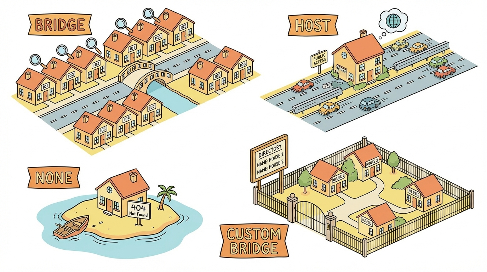
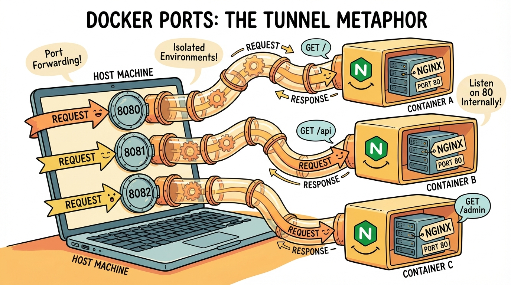
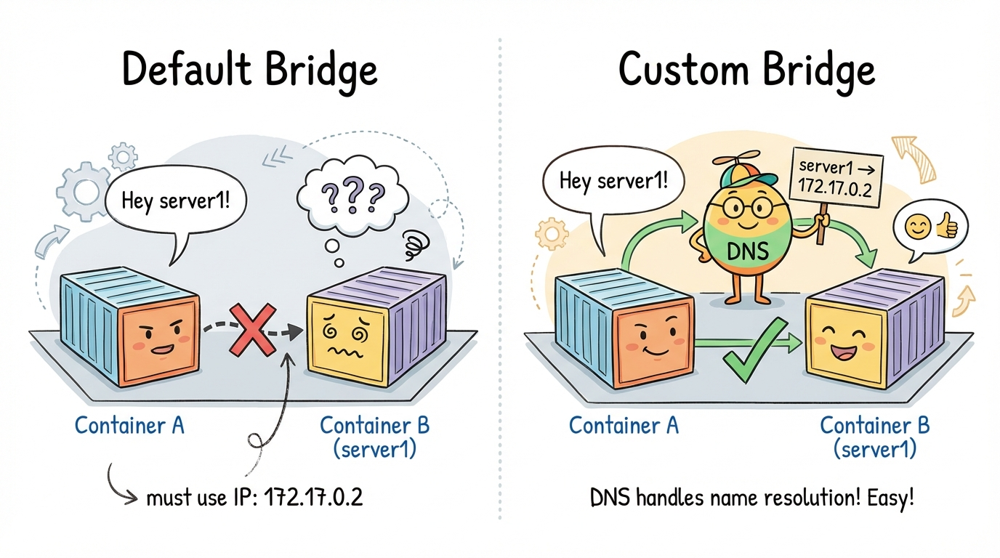
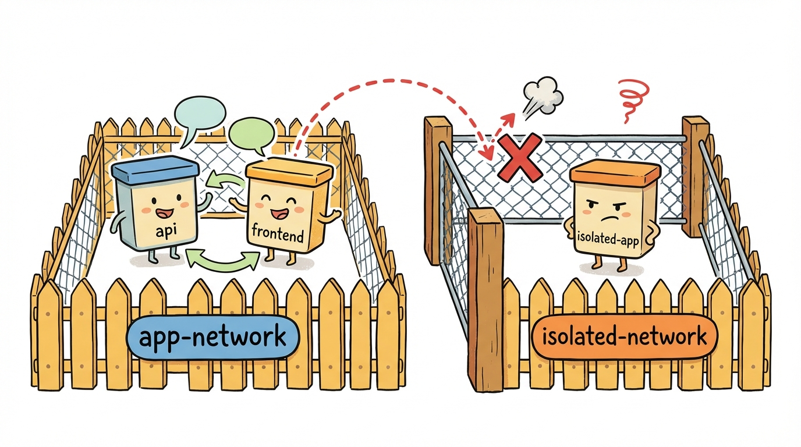

# Module 7: Networking

> 🏷️ When You're Ready

> 🎯 **Teach:** How Docker networking works — port mapping, bridge networks, custom networks, and container-to-container communication.
> **See:** Containers communicating by name on custom networks, and network isolation in action.
> **Feel:** Comfortable connecting containers together and understanding how services discover each other.

> 🔄 **Where this fits:** You've learned to build and run individual containers. Now you'll learn to connect them. This is the bridge to Docker Compose (Modules 8 and 9), where multi-container networking becomes automatic.

## Docker Network Types

> 🎯 **Teach:** The four Docker network types and when to use each one.
> **See:** A comparison table of bridge, host, none, and custom bridge networks.
> **Feel:** Clear about which network type fits each situation.



> 🎙️ Docker provides several network types. The default bridge network connects all containers but doesn't support DNS, so containers can only find each other by IP address. Custom bridge networks add DNS resolution, so containers can find each other by name. The host network removes isolation entirely, and the none network disables networking. For almost all use cases, you want a custom bridge network.

| Type | Description |
|------|-------------|
| `bridge` | Default. Containers on the same bridge can communicate. |
| `host` | Container shares the host's network (no isolation). |
| `none` | No networking at all. |
| Custom bridge | User-defined bridge with DNS-based container discovery. |

> 🎙️ Port mapping is how you make a container's service accessible from outside Docker. Think of it like forwarding a port on your router — you pick a port on your host machine and connect it to a port inside the container. Without port mapping, your container's service is invisible to the outside world.

### Port Mapping

```bash
docker run -p 8080:80 nginx
#            ↑     ↑
#         host   container
```

`-p host:container` maps a host port to a container port.

### Custom Networks

Containers on the **default bridge** can only communicate by IP address. Containers on a **custom bridge** can find each other **by name** (built-in DNS).

```bash
docker network create my-net
docker run --network my-net --name api my-api
docker run --network my-net --name web my-web
# web can reach api at http://api:5000
```

> 💡 **Remember this one thing:** Always use custom bridge networks, never the default bridge. Custom networks give you DNS resolution (containers find each other by name) and better isolation.

## Port Mapping

> 🎯 **Teach:** How to expose container services to the host using port mapping.
> **See:** Multiple containers each serving on different host ports from the same internal port.
> **Feel:** Comfortable mapping any container port to any host port without conflicts.

> 🎙️ Port mapping lets you expose container services to your host machine. You can map any host port to any container port. This means you can run three Nginx containers on ports 8080, 8081, and 8082, all serving port 80 internally. Capital P maps all exposed ports to random host ports, which is useful for avoiding conflicts.



> 🎙️ In this first task, you'll run three separate Nginx containers, each mapped to a different host port. This shows how multiple containers can all listen on the same internal port without any conflict, because each one gets its own isolated network namespace.

### Task A: Map Different Ports

```bash
docker run -d -p 8080:80 --name web1 nginx
docker run -d -p 8081:80 --name web2 nginx
docker run -d -p 8082:80 --name web3 nginx
```

Three Nginx containers, each on a different host port:

```bash
curl -s http://localhost:8080 | head -5
curl -s http://localhost:8081 | head -5
curl -s http://localhost:8082 | head -5
```

All three respond independently on different ports.

```bash
docker stop web1 web2 web3 && docker rm web1 web2 web3
```

> 🎙️ Sometimes you don't care which host port is used — you just need the container to be reachable. Capital P lets Docker pick a random available port for you. This is handy when running multiple instances where you don't want to manually track port numbers.

### Task B: Random Port Mapping

```bash
docker run -d -P --name random-port nginx
docker port random-port
```

`-P` (capital P) maps all exposed ports to random host ports. `docker port` shows the mapping.

```bash
docker stop random-port && docker rm random-port
```

## Default Bridge Network

> 🎯 **Teach:** Why the default bridge network is limited and how its lack of DNS resolution causes problems.
> **See:** Containers communicating by IP address but failing to resolve each other by name.
> **Feel:** Understanding why you should avoid the default bridge for real applications.

> 🎙️ Let's explore the default bridge network and see its limitations. Containers on the default bridge can communicate by IP address, but DNS resolution — looking up a container by its name — does not work. This is a major limitation that custom networks solve.

### Task C: Inspect the Default Network

```bash
docker network ls
docker network inspect bridge
```

The default `bridge` network is always present.

### Task D: Communication on Default Bridge

```bash
docker run -d --name server1 nginx
docker run -d --name server2 nginx
```

Get server1's IP:

```bash
docker inspect --format='{{.NetworkSettings.IPAddress}}' server1
```

Try to reach server1 from server2 by IP:

```bash
docker exec server2 curl -s http://<server1-ip>
```

It works! Now try by name:

```bash
docker exec server2 sh -c 'curl -s http://server1 2>&1 || echo "Cannot resolve hostname — expected on default bridge"'
```

DNS resolution does NOT work on the default bridge network.



```bash
docker stop server1 server2 && docker rm server1 server2
```

## Custom Bridge Networks

> 🎯 **Teach:** How custom networks enable DNS-based service discovery and network isolation.
> **See:** Containers finding each other by name, and containers on different networks being isolated.
> **Feel:** This is how professional Docker deployments work.

> 🎙️ Custom bridge networks are how you should always connect containers. When you create a custom network and attach containers to it, Docker runs an embedded DNS server that lets containers find each other by name. This is the foundation of service discovery — and it's exactly what Docker Compose does automatically under the hood.

### Task E: Create a Custom Network

```bash
docker network create app-network
docker network ls
```

### Task F: Run Containers on the Custom Network

```bash
docker run -d --name api --network app-network nginx
docker run -d --name frontend --network app-network nginx
```

Test DNS resolution by name:

```bash
docker exec frontend curl -s http://api
```

It works! Custom bridge networks provide automatic DNS resolution between containers. This is the standard way to connect services.

> 🎙️ Network isolation is just as important as connectivity. By placing containers on separate custom networks, you can ensure they cannot communicate with each other at all. This is a key security feature — your frontend network doesn't need to talk directly to your database network, for example.



### Task G: Isolate Networks

Create a second network and show containers can't cross:

```bash
docker network create isolated-network
docker run -d --name isolated-app --network isolated-network nginx

docker exec frontend sh -c 'curl -s --max-time 2 http://isolated-app 2>&1 || echo "Cannot reach isolated-app — different network"'
```

Containers on different networks are isolated from each other.

> 💡 **Remember this one thing:** Custom bridge networks provide DNS resolution (containers find each other by name) and network isolation (containers on different networks can't communicate). This is Docker's built-in service discovery.

## Multi-Container Application

> 🎯 **Teach:** How to wire multiple containers together on a custom network to form a working application.
> **See:** A Flask API called by name from another container on the same custom network.
> **Feel:** Ready to build multi-service architectures that Docker Compose will soon automate.

> 🎙️ Let's put networking into practice by building a two-service application. You'll create a Python Flask API, containerize it, put it on a custom network, and call it from another container using its service name. This is the exact pattern that Docker Compose automates for you.

### Task H: Build a Simple Two-Service App

Create a Python API:

```bash
mkdir ~/docker-network-demo
cd ~/docker-network-demo
```

Create `api.py`:

```python
from flask import Flask, jsonify
app = Flask(__name__)

@app.route("/api/greeting")
def greeting():
    return jsonify({"message": "Hello from the API service!"})

if __name__ == "__main__":
    app.run(host="0.0.0.0", port=5000)
```

Create `Dockerfile.api`:

```dockerfile
FROM python:3.12-slim
WORKDIR /app
RUN pip install --no-cache-dir flask
COPY api.py .
EXPOSE 5000
CMD ["python", "api.py"]
```

Build and run on the custom network:

```bash
docker build -f Dockerfile.api -t my-api .
docker run -d --name api-service --network app-network my-api
```

Test from another container on the same network:

```bash
docker run --rm --network app-network python:3.12-slim \
    python3 -c "import urllib.request; print(urllib.request.urlopen('http://api-service:5000/api/greeting').read().decode())"
```

The container resolved `api-service` by name and got the response.

## Cleanup

> 🎯 **Teach:** How to remove containers and networks created during the exercises.
> **See:** All demo resources cleaned up with a few targeted commands.
> **Feel:** Disciplined about leaving your Docker environment clean after every session.

> 🎙️ Great work connecting containers across networks. Before you finish, make sure to clean up all the containers and networks you created. Leaving unused resources around wastes memory and can cause port conflicts in future exercises.

### Task I: Remove Everything

```bash
docker stop api frontend isolated-app api-service 2>/dev/null
docker rm api frontend isolated-app api-service 2>/dev/null
docker network rm app-network isolated-network
docker network ls
```

## Submission

Save a file named `Day_07_Output.md` in this folder containing the terminal output from each task.

> 🎙️ For submission, capture the full sequence — multiple containers on different host ports, the DNS failure on the default bridge, and the DNS success on your custom network. The two-service application where containers find each other by name is the capstone of this module, so make sure that output is clear. Remember to tear down every network and container you created.

### Grading Criteria

| Criteria | Points |
|----------|--------|
| Multiple containers mapped to different host ports | 10 |
| Default bridge inspected and IP-based communication shown | 15 |
| DNS failure on default bridge demonstrated | 10 |
| Custom network created | 10 |
| DNS resolution works on custom network | 15 |
| Network isolation between different networks shown | 10 |
| Two-service app communicating by name | 20 |
| All resources cleaned up | 10 |
| **Total** | **100** |
