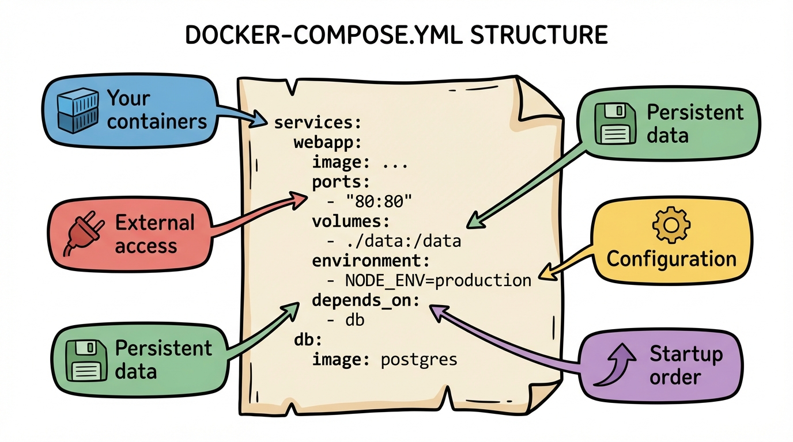
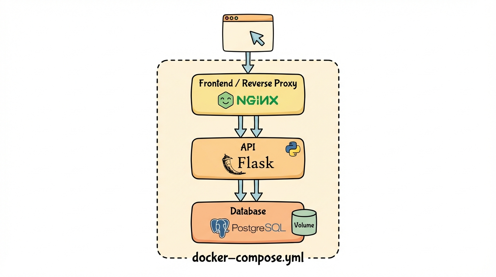

# Module 8: Docker Compose Part 1

> 🏷️ When You're Ready

> 🎯 **Teach:** How to define and run multi-container applications with Docker Compose.
> **See:** A complete web stack (frontend, API, database) defined in a single YAML file.
> **Feel:** Amazed at how much simpler Compose makes multi-container orchestration.

> 🔄 **Where this fits:** In Module 7 you manually created networks and connected containers with multiple docker run commands. Docker Compose replaces all of that with a single file and a single command. This is how real-world Docker projects are organized.

## What Is Docker Compose?

> 🎯 **Teach:** What Docker Compose is and how it replaces multiple docker run commands with a single YAML file.
> **See:** The basic structure of a docker-compose.yml and the essential Compose commands.
> **Feel:** Relieved that managing multi-container stacks just got dramatically simpler.

> 🎙️ Docker Compose lets you define and run multi-container applications with a single YAML file. Instead of running multiple docker run commands with networks and volumes and environment variables, you describe everything declaratively in a docker-compose.yml file. One command — docker compose up — brings the entire stack to life. One command — docker compose down — tears it all down cleanly.


Docker Compose lets you define and run **multi-container applications** with a single YAML file. Instead of running multiple `docker run` commands with networks and volumes, you describe everything in `docker-compose.yml` and start it with one command.

### Basic Structure

```yaml
services:
  web:
    image: nginx
    ports:
      - "8080:80"

  api:
    build: ./api
    ports:
      - "5000:5000"
    environment:
      - DATABASE_URL=postgres://db:5432/mydb

  db:
    image: postgres:16-alpine
    environment:
      - POSTGRES_PASSWORD=secret
    volumes:
      - db-data:/var/lib/postgresql/data

volumes:
  db-data:
```



> 🎙️ Here are the commands you'll use every day with Docker Compose. You don't need to memorize all of them right now — just know that "up" starts everything, "down" stops everything, and "ps" shows you what's running. Those three will get you through most situations.

### Key Commands

| Command | Purpose |
|---------|---------|
| `docker compose up` | Start all services |
| `docker compose up -d` | Start in background |
| `docker compose down` | Stop and remove everything |
| `docker compose ps` | List running services |
| `docker compose logs` | View logs from all services |
| `docker compose build` | Build/rebuild images |
| `docker compose exec <svc> <cmd>` | Run command in a service |

> **Note:** Modern Docker uses `docker compose` (with a space). Older versions used `docker-compose` (with a hyphen).

> 💡 **Remember this one thing:** Docker Compose automatically creates a network for your services. All services in the same compose file can find each other by service name — no manual network creation needed.

## Your First Compose File

> 🎯 **Teach:** How to write a basic docker-compose.yml and use the four essential Compose commands.
> **See:** A single-service Compose project running Nginx with a bind mount and port mapping.
> **Feel:** Comfortable with the up/down/ps/logs workflow you will use daily.

> 🎙️ Let's start simple. You'll create a docker-compose.yml with a single Nginx service, a bind mount for live editing, and a port mapping. Then you'll learn the four essential Compose commands: up, ps, logs, and down. These four commands cover 90 percent of your daily Compose workflow.

### Task A: Create a Simple Compose Project

```bash
mkdir ~/compose-demo
cd ~/compose-demo
```

Create `docker-compose.yml`:

```yaml
services:
  web:
    image: nginx:alpine
    ports:
      - "8080:80"
    volumes:
      - ./html:/usr/share/nginx/html
```

Create the content:

```bash
mkdir html
echo "<h1>Hello from Docker Compose!</h1>" > html/index.html
```

> 🎙️ Now bring it to life. The "docker compose up dash d" command starts all your services in the background. Then you'll check that everything is running and test it with curl. This three-step pattern — up, ps, test — is your standard workflow for launching any Compose project.

### Task B: Start the Services

```bash
docker compose up -d
docker compose ps
curl http://localhost:8080
```

### Task C: View Logs

```bash
docker compose logs
docker compose logs web
docker compose logs -f web     # Follow — Ctrl+C to stop
```

### Task D: Stop Everything

```bash
docker compose down
docker compose ps
```

`down` stops containers, removes them, and removes the network. Clean and simple.

## Multi-Service Application

> 🎯 **Teach:** How to build a real multi-service application with a frontend, API, and reverse proxy.
> **See:** Nginx proxying requests to a Flask API, with containers finding each other by service name.
> **Feel:** This is real-world architecture, and Compose makes it manageable.

> 🎙️ Now let's build something more realistic — a frontend served by Nginx that proxies API requests to a Flask backend. This is a very common pattern in web development. Nginx serves static files and reverse-proxies API calls to the backend service. The two services find each other by name because Compose creates a shared network automatically.

### Task E: Build a Web App with an API

Create project structure:

```bash
mkdir ~/compose-app
cd ~/compose-app
mkdir api frontend
```

Create `api/app.py`:

```python
from flask import Flask, jsonify
import os

app = Flask(__name__)

@app.route("/api/message")
def message():
    return jsonify({
        "message": "Hello from the API!",
        "hostname": os.uname().nodename,
    })

@app.route("/api/health")
def health():
    return jsonify({"status": "healthy"})

if __name__ == "__main__":
    app.run(host="0.0.0.0", port=5000)
```

Create `api/requirements.txt`:

```
flask==3.1.0
```

Create `api/Dockerfile`:

```dockerfile
FROM python:3.12-slim
WORKDIR /app
COPY requirements.txt .
RUN pip install --no-cache-dir -r requirements.txt
COPY app.py .
EXPOSE 5000
CMD ["python", "app.py"]
```

Create `frontend/index.html`:

```html
<!DOCTYPE html>
<html>
<head><title>Compose Demo</title></head>
<body>
    <h1>Docker Compose Demo</h1>
    <p>Frontend served by Nginx, API served by Flask.</p>
    <p>Try: <a href="/api/message">/api/message</a></p>
    <p>Try: <a href="/api/health">/api/health</a></p>
</body>
</html>
```

Create `frontend/nginx.conf`:

```nginx
server {
    listen 80;

    location / {
        root /usr/share/nginx/html;
        index index.html;
    }

    location /api/ {
        proxy_pass http://api:5000;
        proxy_set_header Host $host;
    }
}
```

Create `docker-compose.yml`:

```yaml
services:
  frontend:
    image: nginx:alpine
    ports:
      - "8080:80"
    volumes:
      - ./frontend/index.html:/usr/share/nginx/html/index.html
      - ./frontend/nginx.conf:/etc/nginx/conf.d/default.conf
    depends_on:
      - api

  api:
    build: ./api
    expose:
      - "5000"
```

> 🎙️ Time to start the stack and verify that everything is wired together. You'll hit the frontend directly and also test the API proxy route. If the proxy works, it means Nginx is forwarding requests to the Flask container using the service name "api" — exactly how service discovery works in Compose.

### Task F: Start and Test

```bash
docker compose up -d
docker compose ps
curl http://localhost:8080
curl http://localhost:8080/api/message
curl http://localhost:8080/api/health
```

Notice:
- The frontend is accessible on port 8080
- Nginx proxies `/api/*` requests to the Flask container
- The containers find each other by service name (`api`)
- `depends_on` ensures the API starts before the frontend

> 🎙️ Logs are your best friend when debugging multi-container applications. Docker Compose lets you view logs from all services at once, or filter to just one service. When something goes wrong, this is the first place you should look.

### Task G: Check Logs from Both Services

```bash
docker compose logs
docker compose logs api
docker compose logs frontend
```

## Adding a Database

> 🎯 **Teach:** How to add a database service to a Compose stack with volumes and environment variables.
> **See:** PostgreSQL running alongside your app, queryable via docker compose exec.
> **Feel:** Impressed by how a few lines of YAML add a fully functional database to your stack.



> 🎙️ Let's add PostgreSQL to our stack. This is where you see the real power of Compose — adding a service is just a few lines of YAML. You'll add the database, give it a named volume for persistence, pass credentials through environment variables, and connect it to the API. The API can reach the database at hostname "db" because Compose handles the networking.

### Task H: Add PostgreSQL to the Stack

Update `docker-compose.yml`:

```yaml
services:
  frontend:
    image: nginx:alpine
    ports:
      - "8080:80"
    volumes:
      - ./frontend/index.html:/usr/share/nginx/html/index.html
      - ./frontend/nginx.conf:/etc/nginx/conf.d/default.conf
    depends_on:
      - api

  api:
    build: ./api
    expose:
      - "5000"
    environment:
      - DATABASE_HOST=db
      - DATABASE_PORT=5432
      - DATABASE_USER=postgres
      - DATABASE_PASSWORD=secret
    depends_on:
      - db

  db:
    image: postgres:16-alpine
    environment:
      - POSTGRES_PASSWORD=secret
    volumes:
      - db-data:/var/lib/postgresql/data

volumes:
  db-data:
```

> 🎙️ When you change your docker-compose.yml, you need to bring the stack down and back up for changes to take effect. Compose is smart about this — it only recreates containers whose configuration has changed. The database container will start fresh, and the API now has database connection details in its environment.

### Task I: Restart the Stack

```bash
docker compose down
docker compose up -d
docker compose ps
```

All three services should be running.

> 🎙️ Docker compose exec lets you run commands inside a running service container. Here you'll use it to connect to PostgreSQL and run SQL queries. This is exactly how you'd interact with your database during development — no need to install PostgreSQL on your host machine.

### Task J: Interact with the Database

```bash
docker compose exec db psql -U postgres -c "SELECT version();"
docker compose exec db psql -U postgres -c "CREATE TABLE visits(id serial, visited_at timestamp default now());"
docker compose exec db psql -U postgres -c "INSERT INTO visits DEFAULT VALUES;"
docker compose exec db psql -U postgres -c "SELECT * FROM visits;"
```

### Task K: Stop and Clean Up

```bash
docker compose down
docker compose down -v   # Also removes volumes
```

The `-v` flag removes named volumes too. Without it, `db-data` persists for next time.

> 💡 **Remember this one thing:** `docker compose down` removes containers and networks but keeps volumes. Add `-v` to also remove volumes. This distinction is critical — you don't want to accidentally delete your database data.

## Submission

Save a file named `Day_08_Output.md` in this folder containing terminal output and your `docker-compose.yml` files.

> 🎙️ Include every docker-compose.yml you wrote in this module — the single Nginx service, the Nginx-and-Flask stack, and the full version with PostgreSQL added. Paste the terminal output showing docker compose up, ps, and logs for each. The reverse proxy test, where Nginx forwards to the API by service name, is a favorite question on the quiz, so make sure that output is in your file.

### Grading Criteria

| Criteria | Points |
|----------|--------|
| Simple single-service Compose file working | 10 |
| `docker compose up/down/ps/logs` all demonstrated | 10 |
| Multi-service app with frontend + API | 20 |
| Nginx reverse proxy to API working | 15 |
| PostgreSQL added to the stack | 15 |
| Database queries run via `docker compose exec` | 10 |
| `depends_on` used correctly | 5 |
| Named volume used for database persistence | 10 |
| Everything cleaned up with `docker compose down` | 5 |
| **Total** | **100** |
