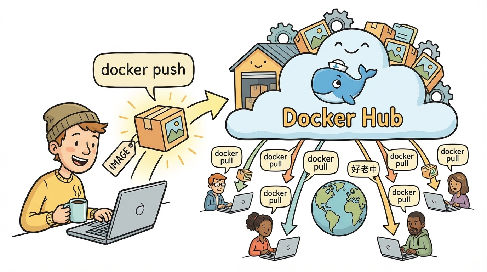
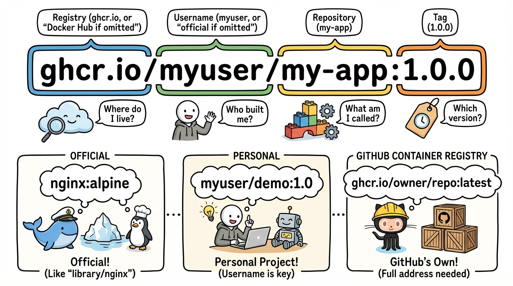
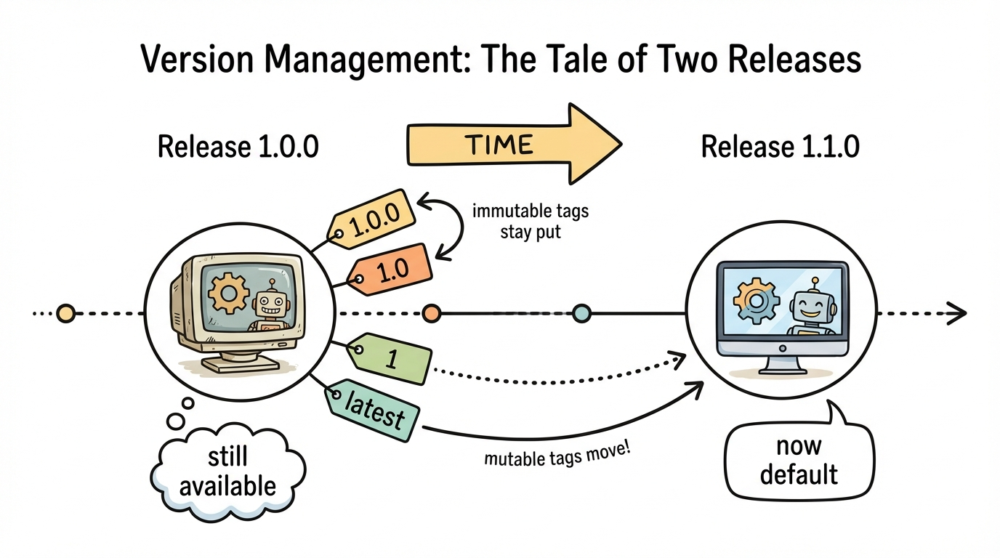
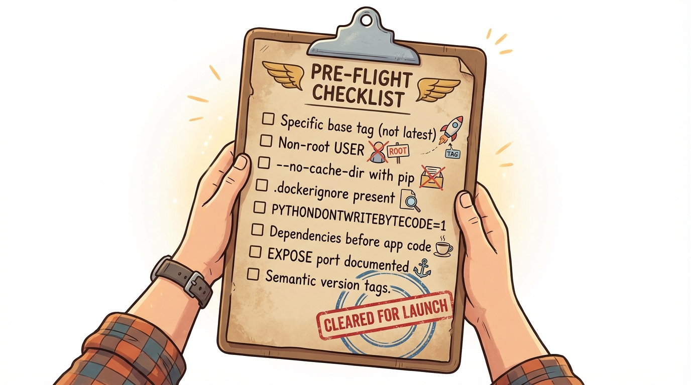

# Module 10: Docker Hub and Registries

> 🏷️ Advanced

> 🎯 **Teach:** How to publish images to Docker Hub, manage versioning with tags, and follow security best practices.
> **See:** The full workflow of building, tagging, pushing, pulling, and running versioned images.
> **Feel:** Ready to share your images with the world and manage releases professionally.

> 🔄 **Where this fits:** This is the capstone module. You've learned to build images, manage containers, persist data, network services, and orchestrate with Compose. Now you'll learn to publish and distribute your work through Docker Hub — completing the Docker lifecycle.

## Docker Hub

> 🎯 **Teach:** What Docker Hub is, how image naming works, and how semantic versioning applies to tags.
> **See:** The registry/username/repository:tag naming convention and a tagging strategy table.
> **Feel:** Clear about how images are named, versioned, and discovered on Docker Hub.



> 🎙️ Docker Hub is the default public registry for Docker images. Every time you've run docker pull nginx or docker run python, you've been downloading from Docker Hub. Now it's your turn to push images there. You'll create an account, tag your images with your username, and push them so anyone in the world can pull and run your applications.

[Docker Hub](https://hub.docker.com) is the default public registry for Docker images. It's where `nginx`, `python`, `postgres`, and thousands of other images come from.

### Image Naming Convention

```
registry/username/repository:tag
```

Examples:
- `nginx:alpine` — Official image (no username)
- `yourusername/my-app:1.0` — Your image
- `ghcr.io/owner/repo:latest` — GitHub Container Registry



> 🎙️ Understanding the image naming convention is essential. The full name includes the registry, your username, the repository name, and a tag. When you omit the registry, Docker assumes Docker Hub. When you omit the username, Docker assumes it's an official image. Tags let you version your images so users can pin to exactly the release they need.

### Tagging Strategy

| Tag | Purpose |
|-----|---------|
| `1.0.0` | Specific version (immutable) |
| `1.0` | Latest patch in 1.0.x |
| `1` | Latest minor in 1.x.x |
| `latest` | Most recent build (default, mutable) |

> 💡 **Remember this one thing:** Use semantic versioning for your tags (1.0.0, 1.1.0, 2.0.0). The `latest` tag is mutable and should always point to your most recent stable release. Specific version tags should never be overwritten.

## Docker Hub Account

> 🎯 **Teach:** How to create a Docker Hub account and authenticate from the command line.
> **See:** The docker login flow and verification that your credentials are active.
> **Feel:** Set up and ready to start pushing your own images.

> 🎙️ First, you need a Docker Hub account. It's free for public repositories. Once you've signed up, you log in from the command line with docker login. This authenticates you so you can push images. Your username becomes part of every image you publish.

### Task A: Create a Docker Hub Account

1. Go to [hub.docker.com](https://hub.docker.com) and create a free account
2. Log in from the CLI:

```bash
docker login
```

Enter your username and password (or access token).

### Task B: Verify Login

```bash
docker info | grep Username
```

## Build, Tag, and Push

> 🎯 **Teach:** The complete workflow for publishing an image to Docker Hub.
> **See:** Building, tagging with multiple versions, and pushing to a public registry.
> **Feel:** The satisfaction of publishing your first public Docker image.

> 🎙️ The publish workflow has three steps: build the image, tag it with your Docker Hub username and version numbers, and push it. You'll create multiple tags for the same image — a specific version like 1.0.0, a minor version like 1.0, and latest. This gives users flexibility in how they pin their dependencies.

### Task C: Create an Image to Push

```bash
mkdir ~/docker-publish
cd ~/docker-publish
```

Create `app.py`:

```python
from flask import Flask, jsonify
from datetime import datetime

app = Flask(__name__)

@app.route("/")
def home():
    return jsonify({
        "app": "Docker Demo",
        "version": "1.0.0",
        "timestamp": datetime.now().isoformat(),
    })

if __name__ == "__main__":
    app.run(host="0.0.0.0", port=5000)
```

Create `requirements.txt`:

```
flask==3.1.0
```

Create `Dockerfile`:

```dockerfile
FROM python:3.12-slim

ENV PYTHONDONTWRITEBYTECODE=1 \
    PYTHONUNBUFFERED=1

WORKDIR /app

RUN adduser --disabled-password --gecos '' appuser

COPY requirements.txt .
RUN pip install --no-cache-dir -r requirements.txt

COPY app.py .

USER appuser
EXPOSE 5000

CMD ["python", "app.py"]
```

> 🎙️ Now you'll build your image and create multiple tags pointing to it. This is a key concept — tags are just labels, not separate copies. One image can have many tags, and they all share the same layers. You'll create a specific version tag, a minor version tag, and the latest tag.

### Task D: Build and Tag

```bash
docker build -t my-demo-app .
```

Tag it for Docker Hub (replace `YOUR-USERNAME` with your Docker Hub username):

```bash
docker tag my-demo-app YOUR-USERNAME/demo-app:1.0.0
docker tag my-demo-app YOUR-USERNAME/demo-app:1.0
docker tag my-demo-app YOUR-USERNAME/demo-app:latest
```

See all your tags:

```bash
docker images | grep demo-app
```

Notice they all have the same Image ID — tags are just labels pointing to the same image.

### Task E: Push to Docker Hub

```bash
docker push YOUR-USERNAME/demo-app:1.0.0
docker push YOUR-USERNAME/demo-app:1.0
docker push YOUR-USERNAME/demo-app:latest
```

Go to `hub.docker.com/r/YOUR-USERNAME/demo-app` in a browser and see your image listed.

## Pull and Run from Docker Hub

> 🎯 **Teach:** How to pull a published image and run it as if on a fresh machine.
> **See:** Local images removed, then the same image pulled from Docker Hub and running successfully.
> **Feel:** Proud that your image is fully self-contained and usable by anyone.

> 🎙️ Now simulate what someone else would experience when using your image. Remove all local copies, then pull and run from Docker Hub. This proves that your image is fully self-contained and anyone can use it with a single docker run command.

### Task F: Simulate a Fresh Machine

Remove the local image and pull it from Docker Hub:

```bash
docker rmi YOUR-USERNAME/demo-app:1.0.0
docker rmi YOUR-USERNAME/demo-app:1.0
docker rmi YOUR-USERNAME/demo-app:latest
docker rmi my-demo-app

docker images | grep demo-app
```

All gone locally. Now pull and run:

```bash
docker run --rm -p 5000:5000 YOUR-USERNAME/demo-app:1.0.0
```

Docker pulls it from Docker Hub and runs it. Press `Ctrl+C` to stop.

## Versioning and Updates

> 🎯 **Teach:** How to release new image versions while keeping old versions available.
> **See:** Two image versions running side by side on different ports.
> **Feel:** In command of a professional release workflow using semantic versioning.



> 🎙️ Software evolves, and your images should evolve with proper versioning. When you release a new version, build the image, tag it with the new version number, update the latest tag to point to it, and push all the tags. Users pinned to 1.0.0 keep getting 1.0.0. Users on latest get your newest code. This is semantic versioning in action.

### Task G: Release a New Version

Update `app.py` — change the version to `"1.1.0"` and add a new endpoint:

```python
@app.route("/api/info")
def info():
    import platform
    return jsonify({
        "python": platform.python_version(),
        "platform": platform.platform(),
    })
```

Build and push the new version:

```bash
docker build -t YOUR-USERNAME/demo-app:1.1.0 .
docker tag YOUR-USERNAME/demo-app:1.1.0 YOUR-USERNAME/demo-app:1.1
docker tag YOUR-USERNAME/demo-app:1.1.0 YOUR-USERNAME/demo-app:latest
docker push YOUR-USERNAME/demo-app:1.1.0
docker push YOUR-USERNAME/demo-app:1.1
docker push YOUR-USERNAME/demo-app:latest
```

Now someone pulling `latest` gets 1.1.0, but `1.0.0` is still available.

> 🎙️ Here's where versioning really pays off. You'll run both version 1.0.0 and version 1.1.0 side by side on different ports. This is how you can test a new release against the old one, or gradually roll out updates in production.

### Task H: Run Different Versions

```bash
docker run --rm -d -p 5000:5000 --name v1 YOUR-USERNAME/demo-app:1.0.0
docker run --rm -d -p 5001:5000 --name v2 YOUR-USERNAME/demo-app:1.1.0

curl http://localhost:5000
curl http://localhost:5001
curl http://localhost:5001/api/info

docker stop v1 v2
```

Both versions running side by side.

## Image Security and Best Practices

> 🎯 **Teach:** Security best practices for Docker images.
> **See:** Vulnerability scanning and a comprehensive best-practices checklist.
> **Feel:** Responsible and security-conscious when publishing images.

> 🎙️ Publishing images comes with responsibility. You should scan your images for known vulnerabilities, run as a non-root user, avoid including secrets, and follow the best practices you've learned throughout this course. Think of this checklist as your pre-flight inspection before publishing.

### Task I: Scan an Image for Vulnerabilities

```bash
docker scout quickview YOUR-USERNAME/demo-app:1.1.0
```

Or if Docker Scout isn't available:

```bash
docker inspect YOUR-USERNAME/demo-app:1.1.0 --format='{{.Config.User}}'
```

Verify the image runs as a non-root user.

### Task J: Best Practices Checklist

Review your image against these best practices:

- [ ] Uses a specific base image tag (not `latest`)
- [ ] Runs as non-root user
- [ ] Uses `--no-cache-dir` with pip
- [ ] Has a `.dockerignore` file
- [ ] Sets `PYTHONDONTWRITEBYTECODE` and `PYTHONUNBUFFERED`
- [ ] Dependencies installed before copying app code (layer caching)
- [ ] `EXPOSE` documents the port
- [ ] Uses semantic version tags (1.0.0, 1.1.0)



> 🎙️ You've completed the full Docker image lifecycle — from building and tagging to pushing, pulling, updating, and scanning. Before wrapping up, clean everything off your local machine. The docker system prune command with the dash a flag removes all unused images, containers, and networks in one shot.

### Task K: Clean Up

```bash
docker system prune -a
```

This removes all unused images, containers, and networks. Use with caution in production!

## Submission

Save a file named `Day_10_Output.md` in this folder containing terminal output and a link to your Docker Hub repository.

### Grading Criteria

| Criteria | Points |
|----------|--------|
| Docker Hub account created and logged in | 10 |
| Image built with proper Dockerfile | 10 |
| Image tagged with multiple version tags | 15 |
| Image pushed to Docker Hub | 15 |
| Image pulled and run from Docker Hub | 10 |
| Updated version pushed with new tag | 15 |
| Two versions run side by side | 10 |
| Best practices checklist completed | 10 |
| System cleaned up | 5 |
| **Total** | **100** |
